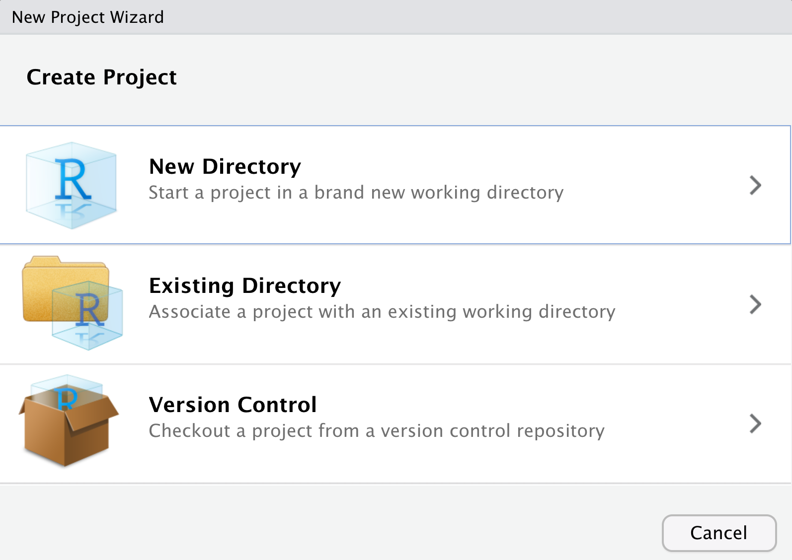
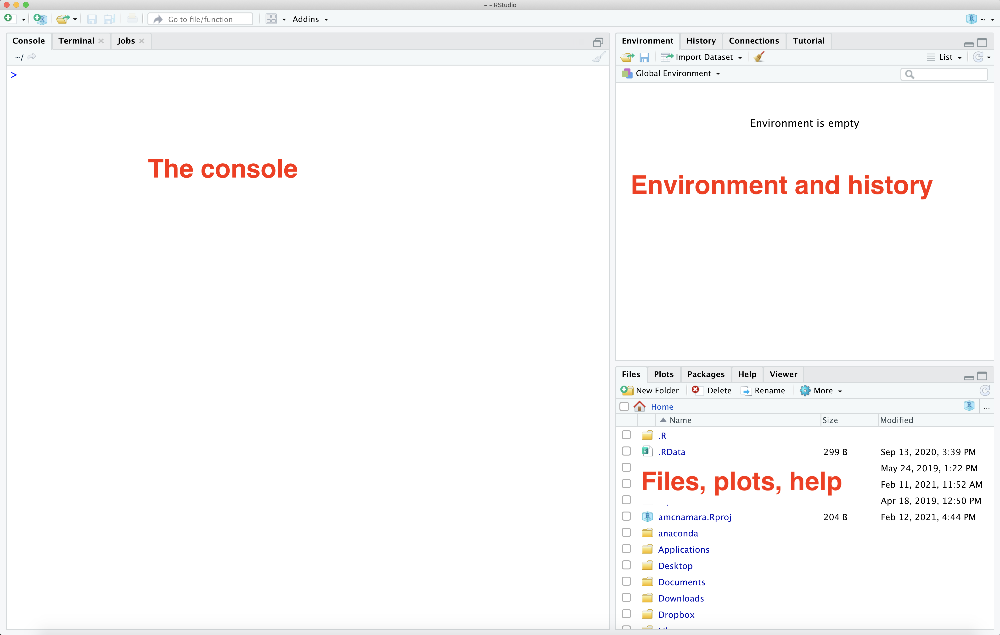
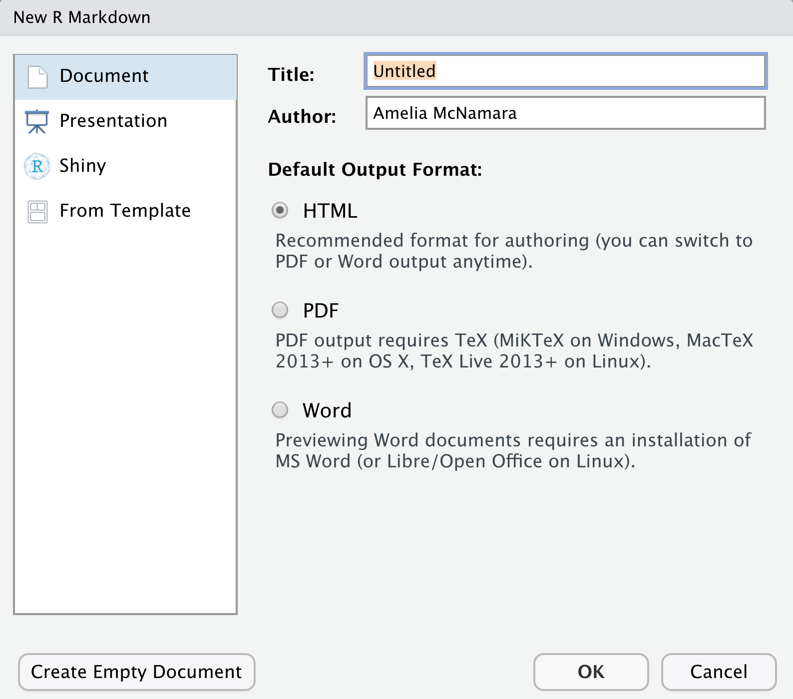
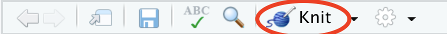
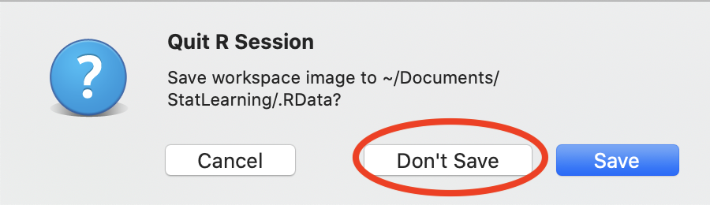

# Pre-work

```{r, echo = FALSE, message=FALSE}
library(knitr)
```


## Installation

Before the workshop, I would like you to install R, RStudio, and a number of R packages. 

- Download and install [R](http://lib.stat.cmu.edu/R/CRAN/)
- Download and install [RStudio Desktop](https://rstudio.com/products/rstudio/) (the free, open source edition)
- Install the following packages: 
```{r, eval=FALSE}
install.packages(c("babynames", "broom",  "car", "fueleconomy",
                   "fivethirtyeight", "GGally", "Hmisc", "infer", 
                   "janitor", "leaps", "lmtest","skimr", "tidyverse",
                   "usethis", "viridis"))
```

(I think these are all the packages we will use during the workshop, but others may come up along the way!)

If you'd like a little more guidance, you can watch this YouTube video where I walk through it:

```{r, fig.cap = 'Installing R and RStudio.', echo = FALSE, out.extra= 'allowfullscreen'}
include_url("https://www.youtube.com/embed/pDuKbv4AOJg")
```

More on R and RStudio:

- `R`: is a programming language specifically designed for statistical analysis. `R` is open-source, and is developed by a team of statisticians and programmers in both academia and industry. It is updated frequently and has become the de facto industry standard. In the data science realm, alternatives to `R` include `Python` with the Pandas library, and `Julia`. In the statistics realm, alternatives include SAS, Stata, and SPSS.
- RStudio: is an Integrated Development Environment (IDE) for `R`. RStudio is also open-source software, and depends upon a valid `R` installation to function. RStudio as available as both a both Desktop and Server application. Before RStudio, people used `R` through the command line directly, or through graphical user interfaces like Rcmdr, but RStudio is so vastly superior that these alternatives have few users left. RStudio employees are important drivers of R innovation, and currently maintain the `rmarkdown`, `knitr`, and `dplyr` packages, among others.
- RMarkdown: is a syntax for composing relatively simple documents that combine `R` code and text. R Markdown is an extension of markdown (a general-purpose authoring format) that provides functionality for processing R code and output.

### Create a project

I **highly, highly** recommend using RStudio's Project feature. Please create a new Project for this workshop. 

To create a Project, go to the File menu, and select New Project. 




If you already have a folder for this workshop, choose "Existing Directory," or if not, choose "New Directory." 

For a more detailed explanation, watch the first two minutes of this video:

```{r, fig.cap = 'Installing R and RStudio.', echo = FALSE, out.extra= 'allowfullscreen'}
include_url("https://www.youtube.com/embed/kpSItJBzijs")
```

(We'll go through more of the video, below)


## Getting started in R

### Learn about the "panels" or "panes" in RStudio

Before we dig into the good stuff, we begin with the fundamental building blocks of R and RStudio: the interface, reading in data, and basic commands.




The panel in the upper right contains your *environment* as well as a history of the commands that you've previously entered.  

Any plots that you generate will show up in the panel in the lower right corner.

The panel on the left is where the action happens.  It's called the *console*. Every time you launch RStudio, it will have the same text at the top of the console telling you the version of R that you're running.  Below that information is the *prompt*.  As its name suggests, this prompt is really a request, a request for a command.  Initially, interacting with R is all about typing commands and interpreting the output. These commands and their syntax have evolved over decades (literally) and now provide what many users feel is a fairly natural way to access data and organize, describe, and invoke statistical computations.

### Arithmetic in R

To get started, enter commands at the R prompt (i.e. right after
`>` on the console); you can either type them in manually or copy and paste them from this document.

Try typing some math into the Console, then hit Enter or Return. R can do anything a fancy calculator can:
```{r, eval = FALSE}
2+2
log(100)
sqrt(100)
abs(-10)
```

### R packages

R has a number of additional packages that help you perform specific tasks. For example,`dplyr` is an R package designed to simplify the process of data wrangling, and `ggplot2` is for data visualization based on the Grammar of Graphics (a famous book). 

In order to use a packages, they must be installed (you only have to do this once) and loaded (you have to do this every time you start an R session). I'm assuming you've already installed the packages I told you to above. If you haven't done that yet, scroll up and do that. Installing packages may take a few minutes; you'll know when the packages have finished installing when you see the R prompt (`>`) return in your console.

### Debugging and anti-frustration tips

Making mistakes is inevitable and necessary when learning a new language. The following will save you some time and frustration:

- Spelling & capitalization matter. `this` and `ThiS` are different.
- With the cursor at the > in the console, use the up arrow to access previous lines without re-typing. You can also find previous lines in the History tab in the upper-right panel of RStudio.
- Type `?abs` to get help and examples for the `abs` function (for example).
- Find help online! There’s a massive RStudio community at [https://community.rstudio.com/](https://community.rstudio.com/), and of course tons of questions about R asked and answered on [http://stackoverflow.com/](http://stackoverflow.com/). If you have a question, somebody’s probably already written about it. Google works pretty well, and even understands `R` as its own word. 


## Exploratory data analysis 

We are going to be looking at plots and summary statistics as part of the technique of Exploratory Data Analysis (EDA). EDA was named by statistician John Tukey in the 1960s, and continues to be exceedingly useful today. Essentially, Tukey was advocating getting familiar with data before beginning modeling, so you don't run into errors that are easy to catch visually but hard to catch numerically. 

To begin, we need to load packages to use in our session. We can do this either with `library()` or `require()`. I try to be consistent and use `library()`, but sometimes slip up and use `require()`.

Let's load the `skimr` and `car` packages. You can type these commands into the Console and hit enter, or copy-paste them from here.

```{r}
library(skimr)
library(car)
```

As you can see above, some "messages" may appear. The messages just give you information, and are not errors. 

Then, we need some data. For this activity, I chose a dataset about `Salaries`,  because it comes with the `R` package `car`. 

Since the data comes from an `R` package, we can access it with the `data()` command,

```{r, echo=FALSE}
knitr::opts_chunk$set(eval = FALSE)
```

```{r}
data(Salaries)
```

Look over at your Environment pane to see what happened in your environment. R uses lazy evaluation, so it's not going to load the data in until we actually do something with it. 

So, let's start by looking at it. 

```{r}
str(Salaries)
```

Looking at the *str*ucture of our data can help, but skimming is even more complete. 

```{r}
skim(Salaries)
```

This data is **tidy**. Tidy data have three key features:

- Each row represents a unit of observation or case.
- Each column represents a variable (ie. an attribute of the cases that can vary from case to case). Each variable is one of two types: quantitative or categorical
- Each entry contains a single data value; no analysis, summaries, footnotes, comments, etc., and only one value per cell.


### Graphics  in R
Now that we have an idea of what the data look like, we can make some plots. 

The next material will follow this video relatively closely, if you'd like to watch me talk through it:

```{r, fig.cap = 'Graphics', echo = FALSE, out.extra= 'allowfullscreen'}
include_url("https://www.youtube.com/embed/wOY2oR7H1qk")
```

There are three prominent graphics libraries in R:

- `graphics`: often called **base** graphics, these are the drawing methods that come pre-installed with R. These graphics are the most commonly-used, but often the least user-friendly. (e.g. `plot()`)
- `lattice`: a nice-looking and powerful graphics library that is particularly adept at making multivariate comparisons. lattice graphics are very convenient and easy-to-learn for most common statistical plots, and are the default for most of the `mosaic` graphing functions. Customization of lattice graphics often involves writing panel.functions – which can be tricky, but powerful. (e.g. `xyplot()`)
- `ggplot2`: a very popular graphing library maintained by Hadley Wickham, based on his “Grammar of Graphics” paradigm. Unlike lattice, `ggplot2` uses an incremental philosophy towards building graphics. (e.g. `ggplot()`)

We may use graphics from all three libraries, but I'll try to focus on `ggplot2` as much as possible.  

### Single-variable plots in ggplot2
Once we understand its structure, we can examine and tell a story with our data! Data visualization is the first natural step. Why?

- Visualizations help us understand what we’re working with: What are the scales of our variables? Are there any outliers, i.e. unusual cases? What are the patterns among our variables?
- This understanding will inform our next steps: What statistical tool / model is appropriate?
- Once our analysis is complete, visualizations are a powerful way to communicate our findings and tell a story.

We’ll start with **univariate**, or single-vatiable visualizations using the `ggplot()` function. Though the learning curve is steep, its “grammar” is intuitive and generalizable once mastered. `ggplot()` is stored in the `ggplot2` package. Once again, to use a package we need to load it (once per session!):

```{r, eval=TRUE}
library(ggplot2)
```

The appropriate visualization depends on whether the variable is **categorical** or **quantitative**. Let's start with quantitiative variables

### Quantitative variables

Here we’ll focus on 2 of many methods for visualizing the distribution of a quantitative variable: histograms & density plots. In examining these viz, keep your eyes on the **center** (what’s a typical value?), **variability** (how spread out are the values?), **shape** (how are values distributed?), **outliers**, and **take-home message**.


Histograms are constructed by (1) dividing up the observed range of the variable into ‘bins’ of equal width; and (2) counting up the number of cases that fall into each bin. Try out the following code, 

```{r}
ggplot(data = Salaries) + geom_histogram(aes(x = salary))
```

- What do you notice about this plot? Where is the distribution centered? What does that mean about salary?

When you ran that code, you probably once again saw a "message," like

```{r, eval=TRUE, echo=FALSE, fig.keep='none'}
ggplot(data = Salaries) + geom_histogram(aes(x = salary))
```

This is `ggplot2` (or perhaps more accurately, its creator, Hadley Wickham) trying to prevent you from falling into a trap of just accepting defaults. There's no one correct way to size bins for a histogram. Try adding the `binwidth` argument to your histogram, like so:

```{r}
ggplot(data = Salaries) + geom_histogram(aes(x = salary), binwidth = 10000)
```

You can play with the binwidth to find one you like, but notice that it needs to be in the scale of the data. If you put `binwidth=1` it will try to make one-dollar-wide bins and probably freeze or crash your R session. (Not to worry, RStudio does a good job of saving your work.)


**Density plots** are essentially smooth versions of the histogram. Instead of sorting cases into discrete bins, the "density" of cases is calculated across the entire range of values. The greater the number of cases, the greater the density! The density is then scaled so that the area under the density curve always equals 1 and the area under any fraction of the curve represents the fraction of cases that lie in that range. If you’ve taken Probability, you can think of the sample density curve as an estimate of the population probability density function. Try the following code, swapping the `geom_histogram` code so it makes a density. 

```{r}
ggplot(data = Salaries) + geom_density(aes(x = salary))
```

### Categorical variables

A **bar chart** provides a visualization of this table. In examining the bar chart, keep your eyes on **variability** (how are cases spread among the categories?) and **take-home message**. 

```{r}
ggplot(data = Salaries) + geom_bar(aes(x = rank))
```

- What is the most common rank? How can you tell? 

### ggplot2 syntax 

Notice that all these plots use the same basic syntax:
`ggplot(data=NameOfData) + geom_[something](aes(x=VariableName))`

`geom`s are short for geometric object, and include `geom_histogram()`, `geom_density()` or `geom_bar()`. There are many other ways to write `ggplot2` code, but we won't think about those for now. 


### Multiple-variable plots in ggplot2

For two quantitative variables, a scatterplot is appropriate. That will use a `geom_point`. Notice that we need to add additional "arguments" to the `aes()` (aesthetic mapping) function, so we have one for `x` and one for `y`. 

```{r}
ggplot(Salaries) + geom_point(aes(x = yrs.since.phd, y = salary))
```

For one quantitative and one categorical variable, you can make side-by-side boxplots

```{r}
ggplot(Salaries) + geom_boxplot(aes(x = sex, y = salary))
```

For two categorical variables, things get trickier. We might want to `facet` a plot so we could compare across groups. 

```{r}
ggplot(Salaries) + geom_bar(aes(x = sex)) + facet_wrap(~rank)
```

- What is this plot showing you? 

### Bells and Whistles

Most R plotting function can take many arguments that will modify their behavior. Read the documentation for more information.

```{r, eval=FALSE}
help(ggplot)
?geom_histogram
```

Again, you can type this code right into your Console, and hit enter. 

### Summary statistics

Again, there are several possible syntaxes for summary statistics. We'll mostly use the tidyverse syntax, which uses the `dplyr` package. Again, let's load the appropriate package.

```{r, eval=TRUE}
library(dplyr)
```

Then, some basic summary statistics looks like this:

```{r}
Salaries %>%
  summarize(mean(salary), sd(salary))
```

That `%>%` operator is called "the pipe," although it looks different than the unix pipe. It moves data from one operation to another. We often pronounce it as "then." "Salaries, then summarize the mean of salary, and the standard deviation of salary."

- How does the information from the `summarize()` relate to what you learned from the histogram and density plot? 

Of course, you can see all this and more in the skim,

```{r}
skim(Salaries)
```

## RMarkdown and reproducible research

By this point, you’ve tried out some syntax in the RStudio console. There are pros and cons to the console:

- The console is **good** for testing out RStudio code & other temporary work.
- The console is **bad** for organizing, communicating, & saving your work.

The tool we will use to overcome this is RMarkdown. RMarkdown is great for organizing, communicating, & saving your work! In fact, this entire tutorial that you’re reading now was constructed using RMarkdown! The basic idea is that you can use RMarkdown to create an HTML / PDF file that includes your text, LaTeX equations, R code (what you type into RStudio), and R output (the corresponding results). In doing so...

- There’s no need to copy and paste between RStudio and Word.

- You have documentation of how you arrived at your conclusions, ie. your work is reproducible. "Reproducible research is the idea that data analyses, and more generally, scientific claims, are published with their data and software code so that others may verify the findings and build upon them." ([Reproducible Research, Coursera](https://www.coursera.org/learn/reproducible-research))

- Revisions are easy. You can change your code and update your entire document at the click of a button!

Create a new RMarkdown document. Go to the File menu, choose New File, R Markdown. You can fill out the boxes with a title and name, or just click Okay. 



This will generate a somewhat-filled-out template that you can modify. 

Useful RMarkdown resources:

- [Alicia Johnson's introduction to RMarkdown](https://drive.google.com/file/d/0Bw_fNDSS255FUEdkY3o1MDEtcVU/view)
- [R Markdown Quick Tour](http://rmarkdown.rstudio.com/authoring_quick_tour.html)
- [RMarkdown cheatsheet](https://github.com/rstudio/cheatsheets/raw/master/rmarkdown-2.0.pdf) (also available from the Help menu!)

## Practice

1. Give your new RMarkdown document an appropriate title and author name (your name!). **Try "knitting" the document** to HTML to see how that process works. 



2. Even though you have installed packages on your computer, you need to tell RStudio which packages you want to actively use in each RMarkdown file. In the code chunk that starts with `setup` at the top of your document, add the following two lines to **load the packages you’ll need** to complete the exercises:

```{r}
library(ggplot2)
library(fivethirtyeight)
```

Once you've added that code to the top "setup" chunk, click the green triangle button to run it. You will likely get a message when you load. 

```{r, echo=FALSE, eval=TRUE}
library(ggplot2)
library(fivethirtyeight)
```

Again, this isn't an error. 

You can also delete everything below that first code chunk. Knit again. Hot tip: Knit often. This will make it easier to debug your code / identify errors.

### Load some data

Let's load a different dataset to play with. This dataset comes from the `fivethirtyeight` package, which you should have loaded above (if you get an error when trying to run the following code, make sure you have run `library(fivethirtyeight)` in your Console, or clicked the green triangle button in the code chunk). 

```{r}
data("hiphop_cand_lyrics")
```

3. **Examine this dataset.**
    + What are the cases in this data set?
    + What are the variables?
    + Use an R function look at a summary of all the data
  
4. **Explore a categorical variable.**
  + Create a bar chart of a categorical variable from the data
  + What is the most common category in that variable?
  
5. **Explore a quantitative variable**
  + Create a histogram of a quantitative variable from the data
  + How is the distribution shaped?
  + Approximately where is it centered?
  + Create a density plot of the same variable. 
  + Which do you prefer, the histogram or the density plot? Why? 
  
6. **Do some numeric summaries**
  + See if you can figure out how to take the median of your quantitative variable
  + Are there any missing values in your categorical or quantitative variable?

7. **Knit your document!** Knit your RMarkdown document. It should yield an HTML file with all of your completed work.

8. **Close down RStudio**. When you close RStudio, it will ask you if you want to save your workspace. It is best practice to say **"Don't Save"** to this dialog.



This means that when you restart R/RStudio, you have a clean Environment to begin with. It is better for reproducible research! 


9. **Complete [my survey](https://stthomas.az1.qualtrics.com/jfe/form/SV_abNBlE1AljQsg6i)** to help me know more about the participants!
  


