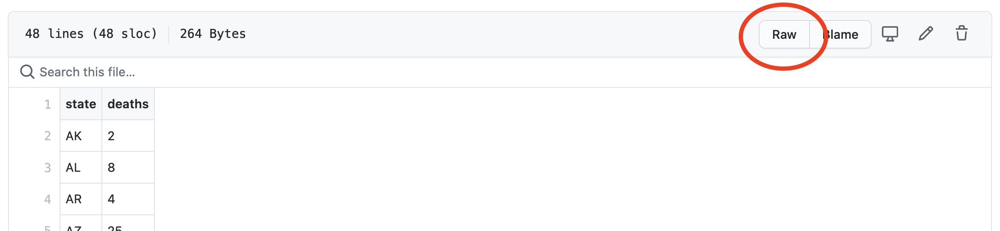
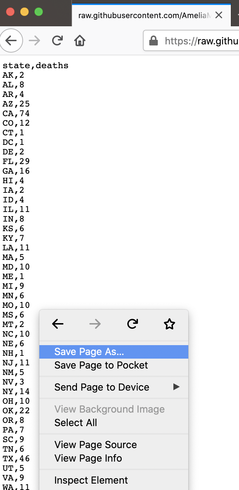

# Inference using simulation methods {#inference}

This section is kind of a grab-bag of computational techniques in support of statistics and inference. We'll introduce some simulation methods: randomization and the bootstrap. We'll use the `infer` package. 


```{r, echo=FALSE, message=FALSE, warning=FALSE}
library(knitr)
opts_chunk$set(eval = FALSE, message = FALSE, error = TRUE)
```

## Reading in external data

So far, we have been working with data that came from within R packages. But, most data we are interested in doesn't come built into R! So, we need to read the data into our environment. The R package `readr` will help with many common file formats. (Another file-reading package is called `haven`, and helps you read in specialty data formatsfrom other statistical packages like SAS and SPSS. If you use a particular kind of data, you can probably find a package to read it into R!)

```{r, eval=TRUE}
library(readr)
```

We are going to work with two datasets, one called `Physicians.csv` and the other called `policekillings.csv` (I don't have provenance information on these datasets, sorry!)

Download those two .csv files.  

You can locate the files on [my GitHub](https://github.com/AmeliaMN/StatLearning/tree/main/data). Select "raw" to see the raw version of the file.



Then, right-click to download the file.



Once you've downloaded those files, place them into the same folder as your RMarkdown file, or inside a sub-folder called something like `data`. 


Let's read in `Physicians.csv` first.

```{r, eval = TRUE}
doctors <- read_csv("data/Physicians.csv")
```


As with other tidyverse functions, `read_csv` gives us a message, telling us how it parsed the data. We can change those defaults if we want to. 

Right off the bat, we notice something strange-- the number of doctors is being read in as a character variable, meaning it is not numeric. We'll come back to that. 


#### Renaming variables

The variable names in this dataset are hard to use,
```{r}
names(doctors)
```

In order to run something like `skim()`, we'd have to use backtics to write out the variable name.

```{r}
doctors %>%
  skim(`Physicians per 100,000 Population`)
```

We can manually rename that variable,

```{r}
doctors %>%
  rename(Physicians = `Physicians per 100,000 Population`)
```
That's better! 

Or, we could use a package to automatically fix all the names in a dataset. 

```{r}
# install.packages("janitor")
library(janitor)

doctors %>%
  clean_names()
```

With either of these approaches, you would need to overwrite the original data with the renamed data in order to use it. For the sake of having a short name, let's use the `rename()` function. 

```{r}
doctors <- doctors %>%
  rename(Physicians = `Physicians per 100,000 Population`)
```

#### Searching for strange issues in variables
But, we've still got a variable type issue. When we run summary statistics, R complains because there is something weird in the data. Let's try `count()`ing up the values in the data. 

```{r}
doctors %>%
  count(Physicians) %>%
  arrange(desc(Physicians))
```

Now we see it! There's a strange NA value that R doesn't know how to deal with. We can actually add this into our data-reading-in code in `read_csv`. 

```{r}
doctors <- read_csv("data/Physicians.csv", 
                    na = c("", NA, "N/A"))
```

Of course, we then have to redo our renaming. 
```{r}
doctors <- doctors %>%
  rename(Physicians = `Physicians per 100,000 Population`)
```

1. Now, you try reading in the `policekillings.csv` dataset. 

```{r, echo=FALSE}
policekillings <- read_csv("data/policekillings.csv")
```

### Joining data 
In the last section, we talked about one-table verbs from `dplyr`. But, another task we often need to do is combine data from one table with data from another table. 

The command that allows you to combine data frames is a "join", which corresponds to the database operation called a `JOIN`. We will focus on the `left_join()` here, but there are many other types of joins. 

When two database tables (or data frames) are joined, the rows of one table get matched to the rows of the other. Computers are exceptionally better suited for this task than humans, but the computer needs to be told what the criteria is for matching up the rows. The variable(s) upon which the matching is based are called a **key**. Both tables must contain the key columns, but there are variety of ways in which the matching can be done. 

Joins can be complicated, so you may want to look at a visual explanation:

- [visualization of database JOINs](http://www.codinghorror.com/blog/2007/10/a-visual-explanation-of-sql-joins.html) 
- [shiny app about R joins](https://beta.rstudioconnect.com/content/1867/)
- [data transformation cheatsheet](https://github.com/rstudio/cheatsheets/raw/master/data-transformation.pdf)


Luckily, R comes with a dataset on state names

```{r}
state.name
state.abb
```

We can use this to make a new variable in the `policekillings` dataset. 

```{r}
policekillings <- policekillings %>%
  mutate(state_long = state.name[match(state, state.abb)])
skim(policekillings)
```

Now, we can do some joining. After all, if we want to understand the relationship between physicians and police killings, we have to have both variables in the same data frame. 

Before we start, let's consider the dimensions of our two data frames.
```{r}
dim(policekillings)
dim(doctors)
```

They don't have the same number of rows, so we should think about how large we want our data to be at the end of our join. Do we want to keep all 51 rows in `doctors` and match elements from `policekillings`, filling with NA values where there aren't matches? Or, are we more interested in `policekillings` and we want to just match the 47 states with elements from `doctors`?

In databases, the default JOIN type is INNER JOIN. In this case only the rows that are present in *both* data frames get returned. In R, I find I most often use a `left_join`, which retains *all* of the records from the first data frame, regardless of whether there is a match in the second data frame. 
Let's try a `left_join`. 

```{r, error=TRUE}
joinedData <- left_join(policekillings, doctors)
```

This throws an error, because it is expecting there to be a variable with the same name in each data set. To get it to work, we need to specify which variables to join on. 

```{r}
joinedData <- left_join(policekillings, doctors,
  by = c("state_long" = "State")
)
skim(joinedData)
```

Notice that this dataset only has 47 observations, because there were only 47 in `policekillings` (the "left" in our `left_join`). We could have reversed the order of the datasets to get something slightly different.

```{r}
joinedData <- left_join(doctors, policekillings,
  by = c("State" = "state_long")
)
skim(joinedData)
```
Now, the data has 51 observations! (We could have gotten the same result by running `right_join` with the data specified the same way as our first join.)

## Fitting a model

While that was a good example for joining data, we shouldn't use it for modeling because a major condition for linear regression is violated with the data set. (Which one?)

So, let's read in another dataset to make some new models. 

```{r}
FirstYearGPA <- read_csv("data/FirstYearGPA.csv")
```

## Testing and training data

One computational strategy for **assess**ing a model is using training and testing data. We can use testing and training data in order to determine if our model is good because it works well on the particular data we fit it on, or if it can be generalized to a larger set of data. 

The basic idea is to break your dataset into two parts: one for training the model (running `lm()`) and one for testing the model (running `predict()`). 

```{r}
set.seed(42)
which_train <- sample(1:219, size = 131, replace = FALSE)

training <- FirstYearGPA %>%
  slice(which_train)
testing <- FirstYearGPA %>%
  slice(-which_train)
```

Notice that I had to "set the seed" to make this document reproducible. That essentially means I'm placing the beginning of the pseudo-random number generator in R at the same spot every time.

We can now run a model,

```{r}
m1 <- lm(GPA ~ HSGPA + HU + White, data = training)
summary(m1)
```

Notice that this model is slightly different than if we'd run the model on the full dataset,

```{r}
coef(lm(GPA ~ HSGPA + HU + White, data = FirstYearGPA))
```

We can use our trained model to make predictions on our testing data.

```{r}
testing <- testing %>%
  mutate(yhats = predict(m1, newdata = testing))
```

We might also want to have the residuals for these predictions, so we can compute those as well.

```{r}
testing <- testing %>%
  mutate(residuals = GPA - yhats)
```

Look at your data object in your environment. What has happened to it?

Once we have this information, we can compute all sorts of useful stuff with it. For example, we could find the "cross-validation correlation," the correlation between the predictions and the actual values.

```{r}
testing %>%
  summarize(cor = cor(GPA, yhats))
```

If we square this number, it's akin to an $R^2$ value,

```{r}
testing %>%
  summarize(cor = cor(GPA, yhats)) %>%
  mutate(R2 = cor^2)
```

Sometimes, we want to quantify the difference between the $R^2$ for the training data and the squared cross validation correlation. 

```{r}
testing %>%
  summarize(cor = cor(GPA, yhats)) %>%
  mutate(R2 = cor^2, shrinkage = summary(m1)$r.squared - R2)
```

You want smaller shrinkage values. 

We can also look at the residual plots for our testing data,

```{r}
ggplot(testing, aes(x = yhats, y = residuals)) +
  geom_point() +
  geom_smooth(se = FALSE)
```

Those don't look too bad to me. We could look closer to see if the mean and standard deviation of the prediction errors look good.

```{r}
testing %>%
  summarize(mean(residuals), sd(residuals))
```

We'd like the mean to be close to 0, and the standard deviation to be close to the standard deviation of the error term from the fit to the training sample. 

```{r}
sd(residuals(m1))
```

Those look pretty good to me!

## Inference based on distributional approximations

If you've taken a statistics class before, you have likely seen inference based on distributional approximations. This is inference using known probability distributions like the Normal distribution, t-distribution, F-distribution, etc. 

In the case of a slope coefficient, one way to make inference would be to create a confidence interval,

$$
\hat{\beta}_1 \pm t^* \cdot SE_{\hat{\beta}_1}
$$

"We are 95\% confident that for a 1-unit increase in x, we would see an [increase/decrease] in the response of between [bottom] and [top] units."

The other inferential task often done with distributional approximations is hypothesis testing. For regression, the hypotheses are 

$$
H_0: \beta_1 = 0 \\
H_A: \beta_1 \neq 0 
$$
We can test the hypothesis by locating

$$
t = \frac{\hat{\beta_1}}{SE_{\hat{\beta_1}}}
$$
in a t-distribution with $df=n-k-1$. When you look at a regression summary, you see p-values based on $t$ values,

```{r}
summary(m1)
```

You can generate confidence intervals based on distributional approximations using `confint()`,

```{r}
confint(m1)
```

However, these distributional approximations only hold if the conditions are upheld. A more general solution is to use simulation-based inference. 


## Simulation-based inference

Recall that the inference for linear regression relies on the assumptions that the following three conditions are met:

1. Linearity
2. Normality of Residuals
2. Equality of Variance

We know how to assess whether these conditions are met, and we have learned a few techniques for correcting them when they are not (e.g. transformations). Today, we will learn a few techniques based on simulation for making *non-parametric* inferences. Such inferences do not rely on stringent assumptions about the distribution on of the residuals. 

## Randomization (Permutation) Tests
We'll consider how we could make inference about a relationship using simulation methods. To do this, we'll use a randomization test. 

Before we begin, let's examine the relationship between two variables from the `FirstYearGPA` dataset graphically. 

```{r}
ggplot(data = FirstYearGPA, aes(x = SATV, y = GPA)) +
  geom_point() +
  geom_smooth(method = lm, se = FALSE)
```

There appears to be some linear association between these variables, but it is not particularly strong. We can quantify this relationship the slope coefficient,

```{r}
m1 <- lm(GPA~SATV, data = FirstYearGPA)
summary(m1)
```

In this case the value of the slope is 0.00169, which is not large, but appears to be statistically significant. However, the validity of the hypothesis test shown in the default regression table relies on the conditions for simple linear regression being met. Let's assume that in this case the assumptions are **not** met. Could we still feel confident that the slope is non-zero? 

If `GPA` and `SATV` were really related, then there is a real relationship binding the $i^{th}$ value of `GPA` to the $i^{th}$ value of `SATV`. In this case it would not make sense link the $i^{th}$ value of `GPA` to the some other value of `SATV`. But if the relationship between these two variables was in fact zero, then it wouldn't matter how we matched up the entries in the variables!

The basic idea of the permutation test is to shuffle the mapping between the two variables many times (i.e. sample *without replacement*), and examine the distribution of the resulting slope coefficient. If the actual value of the slope is a rare member of that distribution, then we have evidence that the null hypothesis of $\beta_1=0$ might not be true. 

- Execute the following code several times. Get a feel for how the regression line can change, depending on the permutation of the data. 
- Do you still believe that the slope is non-zero?

```{r, eval=FALSE}
# for this code to work, you need the mosaic package!
# install.packages("mosaic")
ggplot(data = FirstYearGPA, aes(x = mosaic::shuffle(SATV), y = GPA)) +
  geom_point() +
  geom_smooth(method = lm, se = FALSE)
```

The procedure for the randomization test is simple. We simply shuffle the response variable and compute the resulting slope with the explanatory variable. But we do this many times, until we have a sense of the distribution of that slope coefficient. We then examine where the observed slope falls in that distribution. 

```{r}
slopetest <- FirstYearGPA %>%
  specify(response = GPA, explanatory = SATV) %>%
  hypothesize(null = "independence") %>%
  generate(reps = 5000, type = "permute") %>%
  calculate(stat = "slope")

ggplot(data = slopetest, aes(x = stat)) +
  geom_density() +
  geom_vline(xintercept = 0.0016986, color = "red")
```

This looks pretty weird, visually!

Of course, we can also explicitly find where in the distribution the observed slope lies. 

```{r, eval=FALSE}
slopetest %>%
  get_p_value(obs_stat = 0.0016986, direction = "both")
```

`direction` tells R whether to compute the amount of data to the right or the left of the test statistic, or in both directions. In this case, our alternative hypothesis is $\beta_1 \neq 0$, so we want both sides of the distribution. 

Finally, we can find a non-parametric 95% confidence interval for the slope coefficient. The interpretation here is if our actual slope value fell in this interval, we would **not**  consider it statistically significant.  

```{r, eval=FALSE}
get_ci(slopetest)
```

- Compare this confidence interval to the one returned by `confint()` on original model. Why are they different?
-  Perform the above procedure to test the slope value to predict `GPA` using `SATM`. 
- Perform the above procedure to test the slope value to predict `GPA` using `HSGPA`. 

#### The Bootstrap

A similar simulation technique is the bootstrap, however the bootstrap is most useful for answering the question "what are some other values we could have observed?" (confidence intervals). 

In bootstrapping, we repeatedly sample cases from our data set, *with replacement*, and approximate the sampling distribution of a statistic. The key idea here is that even though the solution to the regression model is deterministic, the data itself is assumed to be randomly sampled, and so all of the estimates that we make in a regression model are **random**. If the data changes, then the estimates change as well. The bootstrap gives us a non-parametric understanding of the distribution of those estimates. Once again, the advantage to this method is that we can construct meaningful confidence intervals for, say, the slope of the regression line, without having to assume that the residuals are normally distributed. 

We'll use this technique to create a confidence interval for the same slope coefficient we were studying in the randomization problem. Remember, here's what that relationship looks like: 

```{r}
ggplot(data = FirstYearGPA, aes(x = SATV, y = GPA)) +
  geom_point() +
  geom_smooth(method = lm, se = FALSE)
```

To create a bootstrap sample, we select rows from the data frame uniformly at random, but with replacement. 

```{r, eval=FALSE}
ggplot(data = resample(FirstYearGPA), aes(x = SATV, y = GPA)) +
  geom_point() +
  geom_smooth(method = lm, se = FALSE)
```

* Note the differences between this plot and the previous one. What do you notice? 
* Run the preceding code several times. What is changing? What is staying the same? 

##### Bootstrap distributions and confidence intervals

One advantage of the bootstrap is that it allows us to construct a sampling distribution for the slope coefficient that is not dependent upon the conditions for linear regression being met. 

The original confidence intervals for our SLR model depend upon the conditions being true. 

```{r}
summary(m1)
confint(m1)
```

Now let's create a bootstrap distribution for the regression coefficients.

```{r, eval=FALSE}
# I'm only doing 100 samples, but you should do more!
slopeboot <- FirstYearGPA %>%
  specify(response = GPA, explanatory = SATV) %>%
  generate(reps = 5000, type = "bootstrap") %>%
  calculate(stat = "slope")

ggplot(data = slopeboot, aes(x = stat)) +
  geom_density() +
  geom_vline(xintercept = 0.0016986, color = "red")
```

The bootstrap distribution will always be centered around the sample statistic from our real data, but shows us some other likely values for the coefficient (essentially, sampling error). One way to quantify this variability is to create a confidence interval. 

There are several methods constructing confidence intervals from the bootstrap. My preferred method does not require that the bootstrap distribution be normal, but works best when it is roughly symmetric. In this case we simply use the percentiles of the bootstrap distribution to build confidence intervals. This method makes the most sense in the most cases. 

```{r, eval=FALSE}
get_ci(slopeboot)
visualize(slopeboot)
```


- Create a bootstrap sample of at least 2000 and construct a confidence intervals using the bootstrap. How does this interval differ from the typical confidence interval? 

- Construct bootstrapped confidence intervals for the $GPA \sim SATV$ and $GPA \sim SATM$ models. 

## Further Reading

- The Boostrapping and Randomization chapters from @IsmKim. 
- @Hest2015
- @Efr1979

## Homework

Use the data from the `nycflights13` package to answer some questions about airline flight delays.

```{r}
library(nycflights13)
```

1. First, you will want to familiarize yourself with the datasets available in the package. There are multiple datasets:

```{r}
?airlines
?airports
?flights
?planes
?weather
```

You may need to make some data visualizations or summary statistics to better understand the data. 

2. Determine which airline had the longest delays. Since we do not have airline codes memorized, we want to see the full name of the airlines, not the codes. In order to answer this question, you will need to join two datasets together. One dataset you will need is `flights`. 

Use the following code skeleton to get started. 
```{r}
flights %>%
  drop_na(arr_delay) %>%
  ___________ %>% # join
  group_by( ) %>% 
  __________ %>% # compute arrival delays
  arrange( ) # arrange arrival delays
```

3. Considering only flights arriving in Baltimore (BWI), see which single variable is the best predictor for delay. 

4. Use bootstrapping to generate a confidence interval for the slope coefficient of your model. 